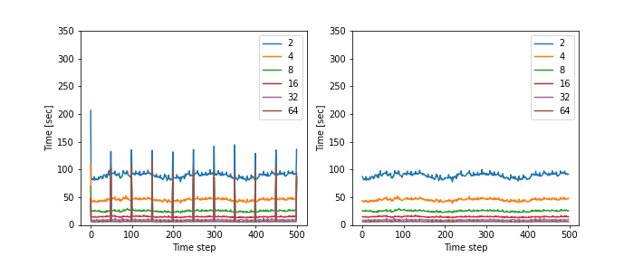
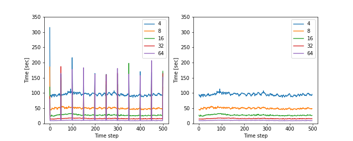
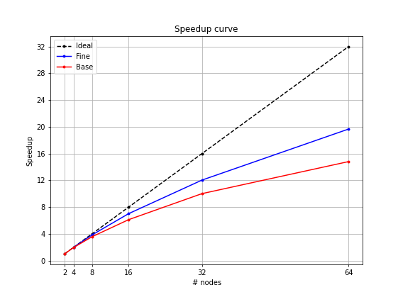
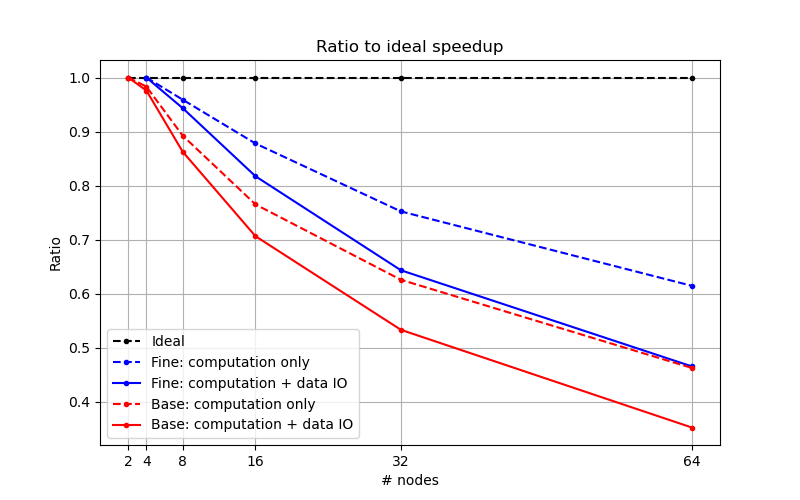

# CharLES scaling study
### Introduction
- Parallel scaling study using 
- CharLES Helmholtz solver in Stampede2 cluster
- Test with 2 meshes in different resolution (base & fine) 
- 6 different number of nodes (2, 4, 8, 16, 32, 64)
  
### Test case
LES simulation for natural ventilation in urban slums of Dhaka, Bangladesh

- Computational domain
    - Domain size: 600 m x 500 m x 150 m (streamwise x spanwise x vertical)
    - Geometries within 100 m from the target house

    (add image)

- Computational grid 

|Case|# cells|Mesh file size(GB)|Restart file size (GB)|Background cell size (m)|Smallest cell size (cm)|
|----|-------|--                |--                    |------------------------|-----------------------|
|Base| 38M   |35                |  9.8                 | 8                      |          5.4          |
|Fine| 85M   |77                | 22                     | 6                      |         4.1           |

- Inflow condition
    - Turbulent ABL with optimization
    - Wind speed and direction from measurement \
    : U_ref = 1.67 m/s @ 25 m, WEST
    - Reynolds stress: similarity relation

- Boundary conditions
    - Top: slip
    - Ground: rough wall, z0 = 0.3 m
    - Two sides: periodic
    - Outlet

### Scaling study
- Stampede2 cluster confiuguration
    - KNL computing nodes ..
      Intel Xeon Phi 7250 (68 CPUs / node)
    - Clock rate: 1.4 Ghz
    - RAM: 96GB DDR4 plus 16GB high-speed MCDRAM
    - Max # of nodes for normal job: 256 (17,408 cores)
    - Max duration: 48 hours

- Test setup 
    - Time step: 0.02 sec (base mesh), 0.01 sec (fine mesh) \
      make CFL# < 1.0
    - Run for 500 time steps
    - Write full solution data every 50 steps
    - Interpolate initial data from the results using coarse mesh

- \# nodes & CPUs

| \# nodes                  |  2 |  4 |  8  |  16 |  32 |  64 |
|----------                 |----|----|---- | ----| ----| ----|
| \# CPUs                   | 136| 272| 544 | 1088| 2196| 4352|
|#Cells / #CPUs (base mesh) |282k|141k|70.7k|35.3k|17.7k|8.84k|
|#Cells / #CPUs (fine mesh) |    |312k|156k |78.2k|39.1k|19.5k|

### Results:
##### Base mesh
(current results only include base mesh case)

1. Time taken for advanding time step \
 
 
Spike at the very first step and every 50 steps due to
    - Reading mesh, inflow data and previous solution data
    - Writing full filed quantitiy data (.sles file)

2. Mean time for time steps \
 
    - Less computation time with more nodes (CPUs) used
    - 

3. Speedup curve \
 
    - Speedup curve = Mean time taken for reference case (i.e. # nodes = 2 for base, # nodes = 4 for fine)\
    / Mean time taken for each case

- Both speedup curves in one plot 
  - Ideal speedup curves are different for base and fine cases because the reference point differs in each case (# nodes = 2 for base, # nodes = 4 for fine)
  - The speedup curve of the fine mesh case is multiplied by 2 \
    (This makes the ideal speedup curve for both base and fine cases the same)

4. Ratio to ideal speedup \
    