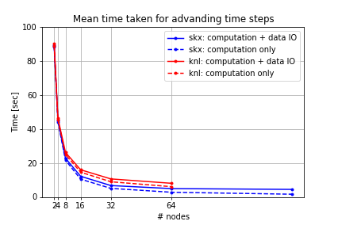
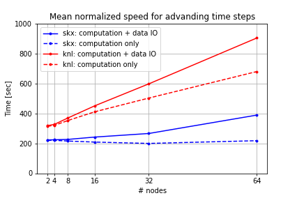
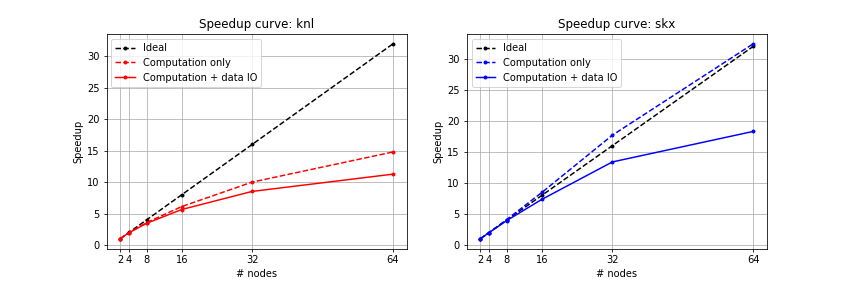
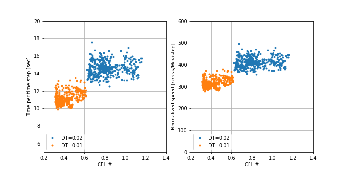
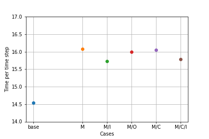

CharLES scaling study

- Parallel scaling study using 
- CharLES Helmholtz solver in Stampede2 cluster
- Test with 3 meshes in different resolution (coarse, base & fine) 
- 6 different number of nodes (2, 4, 8, 16, 32, 64)

---

### Simulation setup

LES simulation for natural ventilation in urban slums of Dhaka, Bangladesh

- Computational domain
    - Domain size: 600 m x 500 m x 150 m (streamwise x spanwise x vertical)
    - Geometries within 100 m from the target house

    (add image)

- Computational grid 

|Case|# cells|Mesh file size(GB)|Restart file size (GB)|Background cell size (m)|Smallest cell size (cm)|
|----|-------|--                |--                    |------------------------|-----------------------|
|Coarse|21|20|8.1|10|6.8|
|Base| 38M   |35                |  9.8                 | 8                      |          5.4          |
|Fine| 85M   |77                | 22                     | 6                      |         4.1           |

- Inflow condition
    - Turbulent ABL with optimization
    - Wind speed and direction from measurement \
      : U_ref = 1.67 m/s @ 25 m, \
      WEST (270 deg) for the first test (base & fine mesh using KNL node) and NNW (330 deg) for the second test (two different computational nodes)
- Reynolds stress: similarity relation
  
- Boundary conditions
    - Top: slip
    - Ground: rough wall function with z0 = 0.5 m, 
    - Building surfaces: algebraic wall model
    - Two sides: periodic
    - Outlet: prefectly non-reflecting 

---

### Scaling study

- Stampede2 cluster confiuguration
    1. KNL computing node (Knights Landing)
       - Intel Xeon Phi 7250 (68 CPUs / node)
       - Clock rate: 1.4 GHz
       - RAM: 96GB DDR4 plus 16GB high-speed MCDRAM
       - Max # of nodes for normal job: 256 (17,408 cores)
       - Max duration: 48 hours
    2. SKX computing node (Skylake)
       - Intel Xeon Platinum 8160 (48 CPUs / node)
       - Clcok rate: 2.1 GHz
       - RAM: 192GB DDR4 
       - Max # of ndes for normal job: 128 (6144)
       - Max duration: 48 hours
- Test setup 
    - Time step: 0.02 sec (coarse, base mesh), 0.01 sec (fine mesh) \
      make CFL# < 1.0
    - Run for 500 time steps
    - Write full solution data every 50 steps
    - Interpolate initial data from the results using coarse mesh
- \# nodes & CPUs

| \# nodes                          | 2    | 4    | 8     | 16    | 32    | 64    |
| --------------------------------- | ---- | ---- | ----- | ----- | ----- | ----- |
| \# CPUs (**KNL**)                 | 136  | 272  | 544   | 1088  | 2196  | 4352  |
| #Cells / #CPUs (coarse mesh, KNL) |      |      |       |       |       |       |
| #Cells / #CPUs (base mesh, KNL)   | 282k | 141k | 70.7k | 35.3k | 17.7k | 8.84k |
| #Cells / #CPUs (fine mesh, KNL)   |      | 312k | 156k  | 78.2k | 39.1k | 19.5k |
|                                   |      |      |       |       |       |       |
| \# CPUs (**SKX**)                 | 96   | 192  | 384   | 768   | 1536  | 3072  |
| #Cells / #CPUs (coarse mesh, SKX) | 223k | 111k | 55.7k | 27.9k | 13.9k | 6.97k |
| #Cells / #CPUs (base mesh, SKX)   | 400k | 200k | 100k  | 50.1k | 25.0k | 12.5k |

### Results 2: KNL vs SKX computational nodes, base mesh

1. Time per time step 

   

2. Normalized speed

3. speedup curve

### Results 1: KNL computational node, base& fine mesh

1. Time taken for advanding time step \
     

   
Figure 1. Time taken for advancing time step

  

  Spike at the very first step and every 50 steps due to

   - Reading mesh, inflow data and previous solution data
   - Writing full filed quantitiy data (.sles file)

2. Mean time for time steps  

   

   
Figure 2. Mean time taken for advancing time steps: both base and fine cases

   - Less computation time with more nodes (CPUs) used

    

  
Figure. Comparison of computational time between two different time step size (DT): time/time step (left) and normalized speed (right)

  

  - Each dot indicates the data of each time step
  - Base mesh, #Nodes = 16 (#CPUs =1088), #Cells/CPUs = 35.3k 
  - Computation time for each time step depends on the size of time step (i.e. DT)

  

 

  
Figure. Comparison of computational time between the cases using different settings (right),  
      <b>M</b>: change in Makefile.in, 	<b>I</b>:using uniform inflow BC, <b>O</b>: not writing image output,	<b>C</b>: using Intel compiler instead of gnu compiler
	

- Base: no change in neither of M/C/I, fastest among the test cases

- Change in Makefile.in (optimization flag: -O2 for stitch, charles, core -> -O3 for charles and core), computational time increases

- Not writing image output files: very small improvement in computation time

- Inflow condtion: time decreases

- Change in compiler: no significant change

  

3. Speedup curve \
    

   
Figure. Speed up curve for computation only and computation +data IO of base(left, red) and fine(right, blue)
 

  - Speedup curve = Mean time taken for reference case (i.e. # nodes = 2 for base, # nodes = 4 for fine)\
    / Mean time taken for each case

  

  

  
Figure. speedup curve(computational only) fore both cases in one image
 

  - Ideal speedup curves are different for base and fine cases because the reference point differs in each case (# nodes = 2 for base, # nodes = 4 for fine)
  - The speedup curve of the fine mesh case is multiplied by 2 \
    (This makes the ideal speedup curve for both base and fine cases the same)

4. Ratio to ideal speedup \
    
