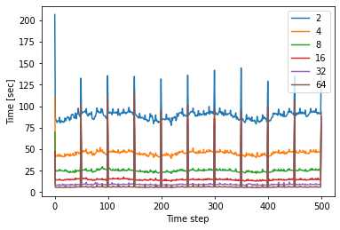
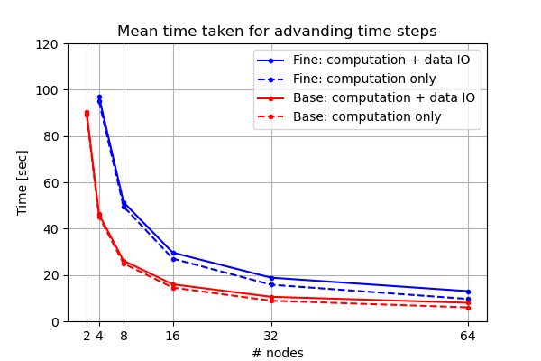
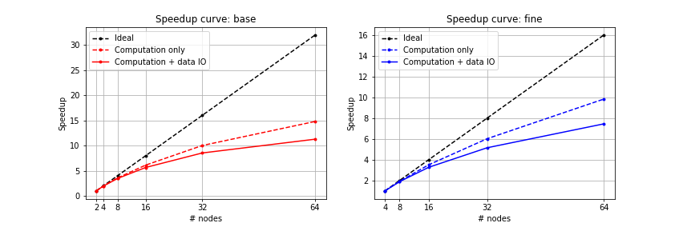

# CharLES scaling study
### Introduction
- Parallel scaling study using 
- CharLES Helmholtz solver in Stampede2 cluster
- Test with 2 meshes in different resolution (base & fine) 
- 6 different number of nodes (2, 4, 8, 16, 32, 64)
  
### Test case
LES simulation for natural ventilation in urban slums of Dhaka, Bangladesh

- Computational domain
    - Domain size: 600 m x 500 m x 150 m ..
    (streamwise x spanwise x vertical)
    - Geometries within 100 m from the target house

    (add image)

- Computational grid 

|    | # cells | Background cell size (m)| Smallest cell size (m)|
|----|-------- |-------------------------|-----------------------| 
|Base| 35M     | 8                       |                       |
|Fine| 85M     | 6                       |                       |

- Inflow condition
    - Turbulent ABL with optimization
    - Wind speed and direction from measurement..
    : U_ref = 1.67 m/s @ 25 m, WEST
    - Reynolds stress: similarity relation

- Boundary conditions
    - Top: slip
    - Ground: rough wall, z0 = 0.3 m
    - Two sides: periodic
    - Outlet

### Scaling study
- Stampede2 cluster confiuguration
    - KNL computing nodes ..
      Intel Xeon Phi 7250 (68 CPUs / node)
    - Clock rate: 1.4 Ghz
    - RAM: 96GB DDR4 plus 16GB high-speed MCDRAM
    - Max # of nodes for normal job: 256 (17,408 cores)
    - Max duration: 48 hours

- Test setup 
    - Run for 500 time steps
    - Write full solution data every 50 steps
    - Interpolate initial data from the results using coarse mesh

- \# nodes & CPUs
 
| \# nodes     |  2 |  4 |  8 | 16 | 32 | 64 | 
|----------    |----|----|----|----|----|----|
| \# CPUs      | 136| 272| 544|1088|2196|4352|
|#Cells / #CPUs (base mesh)|282k|141k|70.7k|35.3k|17.7k|8.84k|
|#Cells / #CPUs (fine mesh)| | | | | | |

### Results:

